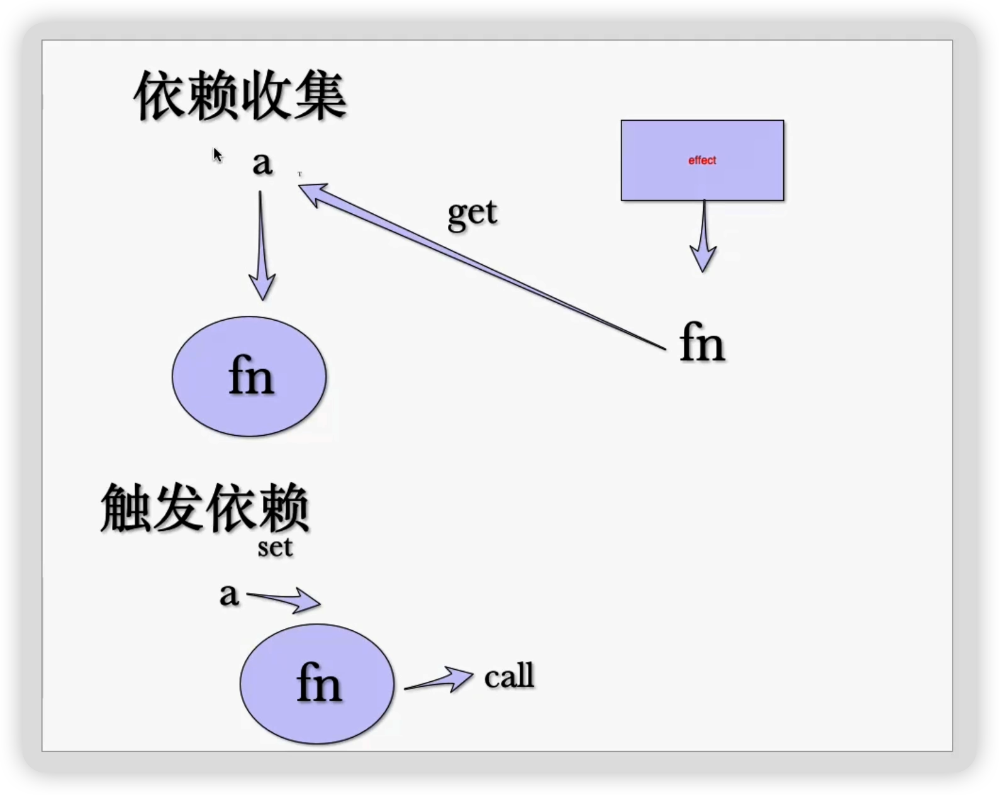
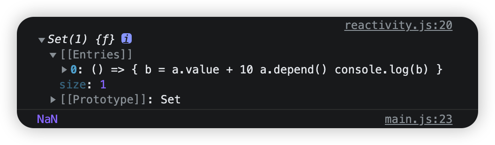

## 实现 reactivity 的 ref 逻辑

首先我们需要安装 `reactivity`: `npm i @vue/reactivity`

源代码用法示例代码：

```js
// 由于我们目前还没有使用框架，故路径必须写全，后面的 .js 不能省略
import { ref, effect } from '../node_modules/@vue/reactivity/dist/reactivity.esm-browser.js'

const a = ref(10)
let b

effect(() => {
  // 收集依赖
  b = a.value + 10
  console.log(b)
})

// 触发依赖
a.value = 20
```

### 定义 Dep

`ref` 的使用方式是：`const a = ref(10)`

接收一个参数，有返回值

所以我们也需要接收一下

```js
export class Dep {
  constructor(value) {
    this._value = value
  }
}
```

由于我们使用的是 `class`，`new` 以后会返回实例，返回值也解决了

### 收集依赖



我们创建一个 `depend` 方法来收集依赖

```js
depend() {}
```

然后再创建一个依赖存放的池子：

```js
constructor(value) {
  this.effects = new Set()
}
```

使用 `Set` 保证依赖的唯一性

然后在 `depend` 函数中收集依赖

```js
depend() {
  this.effects.add(currentEffect)
}
```

那这个 `currentEffect` 哪里来的呢？

其实就是 `effect` 函数的回调函数

所以我们还需要创建一个 `currentEffect` 全局变量及 `effect` 函数

```js
let currentEffect = null
```

```js
depend() {
  if (currentEffect) {
    this.effects.add(currentEffect)
  }
}
```

为了不和 `reactivity` 的 `effect` 重名，我们使用 `effectWatch`

而且 `effect` 初始化就调用一次，这时候就是我们收集依赖的时候

```js
export function effectWatch(fn) {
  // 赋值依赖
  currentEffect = fn
  // 回调函数调用，触发收集依赖
  fn()
  // 清空依赖
  currentEffect = null
}
```

所以我们需要在 `fn` 回调中手动触发收集依赖函数 `depend`

```js
effectWatch(() => {
  b = a.value + 10
  a.depend()
  console.log(b)
})
```

调试发现依赖已被收集到了，但 `b` 的值是 `NaN`



这是因为 `a.value` 我们还没有呢，所以加一下

```js
get value() {
  return this._value
}
```

这样收集依赖就完成了

### 触发依赖

我们还需要写一个触发依赖的函数，这个就比较简单了，循环调用一下依赖就可以了

```js
notice() {
  this.effects.forEach(effect => {
    effect()
  })
}
```

我们还需要手动调用一下触发依赖的函数：

```js
a.value = 20
a.notice()
```

由于这里是 `set` 操作，所以我们还需要增加一下逻辑：

```js
set value(value) {
  this._value = value
}
```

这样触发依赖也完成了

### 优化

`depend` 与 `notice` 目前是我们手动调用的

而这其实是不符合我们日常使用逻辑的：我们只管取值和赋值，依赖收集和触发为什么也需要我们做呢？

所以需要把收集和触发封装到框架中

`depend` 是与 `get` 一起的，`get` 完成以后触发 `depend` 逻辑；`notice` 与 `set` 也同理

```js
get value() {
  this.depend()
  return this._value
}

set value(value) {
  this._value = value
  this.notice()
}
```
