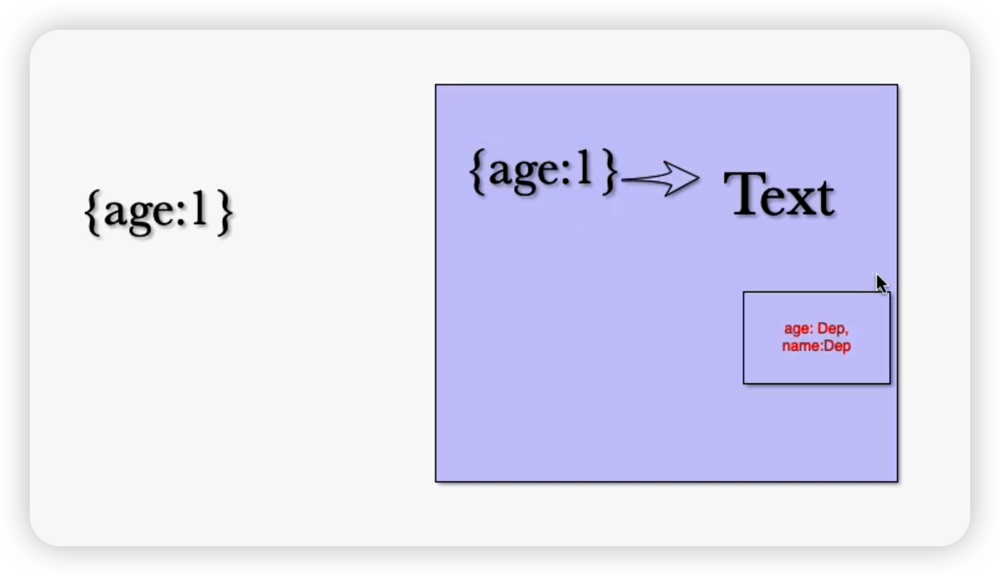

## 实现 reactivity 的 reactive 逻辑

源代码用法示例代码：

```js
import { reactive, effect } from '../node_modules/@vue/reactivity/dist/reactivity.esm-browser.js'

const user = reactive({ age: 10 })
let nextAge = 0

effect(() => {
  nextAge = user.age + 1
  console.log(nextAge)
})

user.age++
```

### 定义 reactive

由示例可知接收一个对象参数，返回一个响应式对象

所以我们使用 `Proxy` 来处理对象的响应式逻辑

```js
export function reactive(raw) {
  return new Proxy(raw, {})
}
```

### 收集依赖和触发依赖

`Proxy` 第二个参数可以传入 `get` 与 `set`，借鉴 `ref` 的处理：

```js
return new Proxy(raw, {
  get(target, key) {
    dep.depend()
    return target[key]
  },
  set(target, key, value) {
    target[key] = value
    dep.notice()
  }
})
```

那 `dep` 如何获取呢？而且 `get` 和 `set` 这两个的 `dep` 应该是同一个

这就涉及到 `dep` 的存储问题

这个 `dep` 应该和具体对象(target)及其里面的具体的值(key)匹配的

比如 `age` 就和 `user` 里面的 `age` 匹配；`name` 就和 `user` 里面的 `name` 匹配

所以这里面是有两层映射关系来找到对应的 `dep`，如下图所示：



### 处理 dep

首先我们需要创建一个全局映射变量：`const targetsMap = new Map()`，使用 `Map` 是因为可以使用对象作为 `key`

然后就需要获取 `dep`：

```js
let depMap = targetsMap.get(target)
if (!depMap) {
  depMap = new Map()
  targetsMap.set(target, depMap)
}
let dep = depMap.get(key)
if (!dep) {
  // 这里我们就不需要传入值了，因为通过 target[key] 就可以拿到
  // 这里只是使用它的依赖收集及触发功能
  dep = new Dep()
  depMap.set(key, dep)
}
```

由于 `get` 和 `set` 都需要这段逻辑，就将其提取为函数：

```js
export function reactive(raw) {
  return new Proxy(raw, {
    get(target, key) {
      const dep = getDep(target, key)
      dep.depend()
      return target[key]
    },
    set(target, key, value) {
      target[key] = value
      const dep = getDep(target, key)
      dep.notice()
      return true
    }
  })
}

function getDep(target, key) {
  let depMap = targetsMap.get(target)
  if (!depMap) {
    depMap = new Map()
    targetsMap.set(target, depMap)
  }
  let dep = depMap.get(key)
  if (!dep) {
    // 这里我们就不需要传入值了，因为通过 target[key] 就可以拿到
    // 这里只是使用它的依赖收集及触发功能
    dep = new Dep()
    depMap.set(key, dep)
  }
  return dep
}
```

### 优化

上面 `set` 逻辑中我们最后有 `return true`，是因为不加的话会报错：

> Uncaught TypeError: 'set' on proxy: trap returned falsish for property 'age'

而目前规范的做法是使用 `Reflect`:

```js
get(target, key) {
  const dep = getDep(target, key)
  dep.depend()
  return Reflect.get(target, key)
},
set(target, key, value) {
  const result = Reflect.set(target, key, value);
  const dep = getDep(target, key)
  dep.notice()
  return result
}
```
