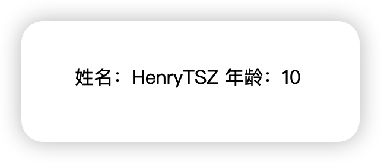
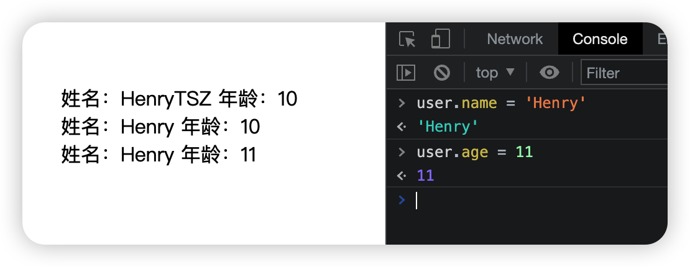
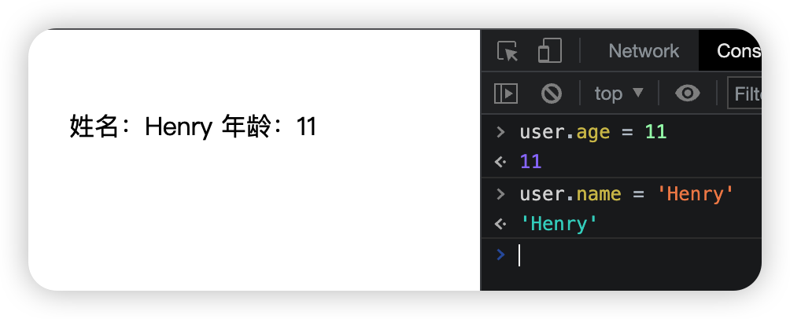

## 0-1-3-实现 mini-vue 的雏形

### 初步验证

我们目前已经实现了 `ref` 和 `reactive` 的响应式逻辑，以前都是在 `effectWatch` 中操作数据，而如果换成 `UI` 处理，就可以在页面展示出来了，这样就可以实现一个 `mini-vue` 的雏形了

```js
import { reactive, effectWatch } from './core/index.js'

const user = reactive({ name: 'HenryTSZ', age: 10 })

effectWatch(() => {
  const element = document.createElement('div')
  const nameText = document.createTextNode(`姓名：${user.name} \r`)
  const ageText = document.createTextNode(`年龄：${user.age}`)
  element.appendChild(nameText)
  element.appendChild(ageText)
  const app = document.getElementById('app')
  app.appendChild(element)
})
```



可以看到已经在页面展示出数据了，由于我们目前还不好操作数据，可以把数据绑定到 `window` 上，这样就可以验证响应式了

```js
const user = reactive({ name: 'HenryTSZ', age: 10 })
window.user = user
```



可以看到响应式也没有问题，出现 3 行是因为我们重新渲染时没有清掉原来到内容，清除一下即可

```js
const app = document.getElementById('app')
app.textContent = ''
```

### 实现雏形

ok，验证通过，那我们就可以写的更像 `Vue3` 组件一样

```js
const App = {
  render(context) {
    effectWatch(() => {
      const app = document.getElementById('app')
      app.textContent = ''
      const element = document.createElement('div')
      const nameText = document.createTextNode(`姓名：${context.user.name} \r`)
      const ageText = document.createTextNode(`年龄：${context.user.age}`)
      element.appendChild(nameText)
      element.appendChild(ageText)
      app.appendChild(element)
    })
  },
  setup() {
    const user = reactive({ name: 'HenryTSZ', age: 10 })
    window.user = user
    return { user }
  }
}

App.render(App.setup())
```



也没有问题

看代码结构，非常符合 `Vue3` 组件的结构，`setup` 定义数据并返回，`render` 处理 `UI`，已经有了雏形了

但这里有两个最关键的问题：

1. 更新是全量的，而不是哪里改变更新哪里，需要优化
2. `render` 里是写死的 `Dom`，但用户有时候是需要渲染到其他平台的，跨平台的问题
