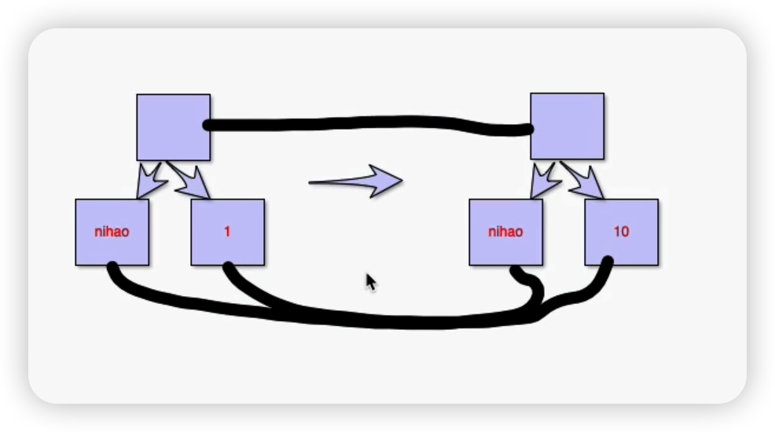
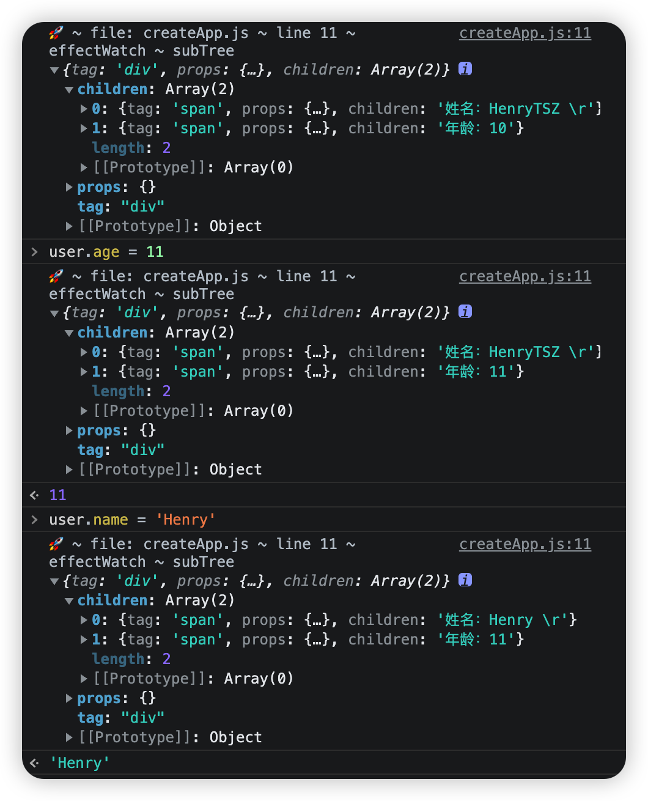

## 0-1-5-虚拟节点 vnode

在前面小节中我们提出过一个需要优化的点：

> 更新是全量的，而不是哪里改变更新哪里，需要优化

### 优化思路

其实也比较简单，只需要对比出来哪些节点的值变更了，只更新这些变更的即可



如上图所示，`nihao` 节点没有变更，而另一个节点从 `1` 变更到 `10`，我们只需要更新这个节点即可

### 如何比较

我们可以通过 `Dom` 来比较，比如获取其 `children` 及属性来比较是否变更，但访问 `Dom` 对象上的 `get` 和 `set` 方法时，会影响浏览器的渲染，使其变慢

那还有什么方法可以比较呢？

我们可以用一个普通对象来表示一个节点的状态

以下面为例：

```js
const element = document.createElement('div')
element.setAttribute('id', 'test')
element.append(document.createTextNode('nihao'))
```

我们可以知道 `div` 是一个关键点，是这个节点的 `tag` 标签

然后 `id: test` 也是一个关键点，是这个节点的属性，而且可能有多个

然后 `nihao` 也是一个关键点，是这个节点的 `children`，而且可能有多个

那我们总结一下，上方的创建 `element` 的代码就可以用下方的对象来表示：

```js
{
  tag: 'div',
  props: {
    id: 'test'
  },
  children: 'nihao'
}
```

至此我们就完成了用一个对象来表示一个节点了

### 实现简易版 h

基于上方的逻辑就可以完成简易版的 `h` 方法：

```js
export function h(tag, props, children) {
  return { tag, props, children }
}
```

然后在 `render` 中使用 `h` 替代以前的 `Dom` 操作

```js
render(context) {
  // const element = document.createElement('div')
  // const nameText = document.createTextNode(`姓名：${context.user.name} \r`)
  // const ageText = document.createTextNode(`年龄：${context.user.age}`)
  // element.appendChild(nameText)
  // element.appendChild(ageText)
  // return element
  return h('div', {}, [
    h('span', {}, `姓名：${context.user.name} \r`),
    h('span', {}, `年龄：${context.user.age}`)
  ])
}
```

在 `createApp` 中输出验证一下：

```js
effectWatch(() => {
  rootContainer.textContent = ''
  const subTree = rootComponent.render(setupResult)
  console.log('🚀 ~ file: createApp.js ~ line 11 ~ effectWatch ~ subTree', subTree)
  // 由于 subTree 不是真实的 Dom，无法添加，先注释掉
  // rootContainer.appendChild(element)
})
```



可以看到首次输出和自适应均没有问题

这样我们就有了对应的虚拟节点，以及虚拟节点表现出来的就是一个普通对象，只不过是一种树结构，通过 `children` 一层一层链接起来的

那我们下一步就是将其转换为真实 `Dom`，然后添加到视图中
