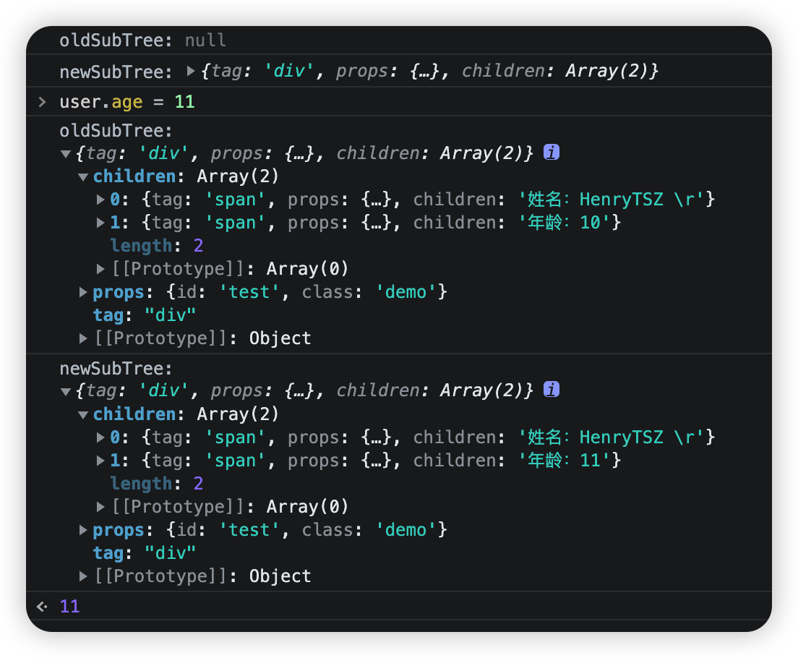

## 0-1-7-diff(1)

在去实现 `diff` 算法之前，我们先来回顾一下当初为什么要引入虚拟节点及 `mountElement`:


如上图所示，只有第一个 `p` 节点发生了变化，所以我们只需要更新该节点即可

### 获取新旧值

如果要去对比的话，我们必须知道新的数据及旧的节点

对于我们目前的程序的话，`subTree` 就是新的数据，所以我们需要存储一下旧的数据

```js
mount(rootContainer) {
  const setupResult = rootComponent.setup()
  let prevSubTree = null
  effectWatch(() => {
    rootContainer.textContent = ''
    const subTree = rootComponent.render(setupResult)
    console.log('oldSubTree:', prevSubTree)
    console.log('newSubTree:', subTree)
    prevSubTree = subTree
    mountElement(subTree, rootContainer)
  })
}
```



可以看到首次渲染时 `oldSubTree` 没有值，而更新后，新旧都有值了，并且值也是对的

这样我们就可以对比了，只要对比出来不一样了，只更新该值对应的 `Dom` 即可

### 区分首次渲染还是更新

这里还涉及一个流程，我们只需要在首次渲染时调用 `mountElement`，后续更新的话只更新具体变动的值即可

所以我们还需要一个变量：`isMounted`，表示是否已挂载

如果没有挂载，就执行原来的逻辑，不过 `rootContainer.textContent = ''` 就不用执行了

如果已挂载，就执行更新逻辑，先获取新数据，然后执行 `diff` 算法，最后更新 `prevSubTree`

```js
let isMounted = false
effectWatch(() => {
  if (isMounted) {
    const subTree = rootComponent.render(setupResult)
    console.log('oldSubTree:', prevSubTree)
    console.log('newSubTree:', subTree)
    // diff(prevSubTree, subTree)
    prevSubTree = subTree
  } else {
    isMounted = true
    const subTree = rootComponent.render(setupResult)
    prevSubTree = subTree
    mountElement(subTree, rootContainer)
  }
})
```

调试发现逻辑也没有问题

那我们就去实现 `diff` 算法

### 实现 tag 的 diff

我们 `diff` 函数仍写在 `renderer.js` 文件中，接收两个参数：`oldSubTree` 和 `subTree`，里面要分别处理 `tag`，`props` 及 `children`

```js
/**
 * diff
 * @param {vnode} n1 oldSubTree
 * @param {vnode} n2 subTree
 */
export function diff(n1, n2) {
  // 1. 处理 tag
  // 2. 处理 props
  // 3. 处理 children
}
```

我们先来看 `tag`

这个比较简单，比如老的是一个 `p` 标签，新的是一个 `div` 标签，那我们只需要把老的干掉，直接替换为新的就可以了

使用 `el.replaceWith(newEl)` 即可替换

不过我们这里只有虚拟节点，没有真实 `Dom`，所以需要在 `mountElement` 中把真实 `Dom` 赋值到虚拟节点上

```js
const el = (vnode.el = createElement(tag))
```

```js
if (n1.tag !== n2.tag) {
  n1.el.replaceWith(createElement(n2.tag))
} else {
}
```

然后我们构造一个测试数据：

```js
// test tag
// user.tag = 'p'
render(context) {
  return h(context.user.tag, {}, '')
},
setup() {
  const user = reactive({ name: 'HenryTSZ', age: 10, tag: 'div' })
  window.user = user
  return { user }
}
```

测试发现修改 `user.tag = 'p'` 后，页面的 `Dom` 会同步修改，但再修改为 `span` 时，报错了：

> renderer.js:59 Uncaught TypeError: Cannot read properties of undefined (reading 'replaceWith')

调试发现 `n1.el` 是 `undefined`，这是因为第一次更新时，`n1.el` 是 `mountElement` 给的，而本次更新我们没有将其赋值给 `n2`，导致下次更新时，`n2` 变成了 `n1` 了，当然没有 `el` 了，所以还需要将 `el` 赋值给 `n2`

```js
if (n1.tag !== n2.tag) {
  n1.el.replaceWith(createElement(n2.tag))
  n2.el = n1.el
} else {
}
```

再次测试，修改为 `span` 是不报错了，但并没有将 `p` 标签改为 `span` 标签

再次调试发现使用 `replaceWith` 以后，`n1.el` 已经不是页面的标签了，相当于使用新标签替换旧标签，旧标签已经被移除了，所以 `n2.el` 应该是 `createElement` 创建出来的

```js
if (n1.tag !== n2.tag) {
  const newEl = createElement(n2.tag)
  n1.el.replaceWith(newEl)
  n2.el = newEl
} else {
}
```

再次测试，修改为 `span` 不报错了，也将 `p` 标签改为 `span` 标签

但修改顺序为 `p -> p -> span` 时，又报上面的错误了，这是由于 `tag` 不变时，我们仍需要给 `n2.el` 赋值

```js
if (n1.tag !== n2.tag) {
  const newEl = createElement(n2.tag)
  n1.el.replaceWith(newEl)
  n2.el = newEl
} else {
  n2.el = n1.el
}
```

再次测试终于没有问题了

我们还可以将 `n1.el` 提取一下：

```js
const el = (n2.el = n1.el)
if (n1.tag !== n2.tag) {
  const newEl = createElement(n2.tag)
  el.replaceWith(newEl)
  n2.el = newEl
} else {
}
```

测试也没有问题

### 实现 props 的 diff

然后我们在 `else` 中处理 `props`，因为只有在 `tag` 相等的情况下我们才会处理其余属性，否则直接替换就可以了

处理 `props` 有两种情况：

1. 新的有，老的没有，执行 add
2. 新老都有，值不同，执行 update
3. 老的有，新的没有，执行 remove

对于前两种情况，我们可以遍历 `newProps`，分别比较新老的值，如果不同（老的如果没有，就是 `undefined`，与新值不同，执行 `add`；如果老的有，但与新值不同，就是 `update`），就调用 `patchProps`

```js
const oldProps = n1.props
const newProps = n2.props
// add / update
if (newProps) {
  for (const key in newProps) {
    if (Object.hasOwnProperty.call(newProps, key)) {
      const newValue = newProps[key]
      const oldValue = oldProps[key]
      if (newValue !== oldValue) {
        patchProps(el, key, oldValue, newValue)
      }
    }
  }
}
```

对于第三种情况，我们可以遍历 `oldProps`，只需要判断 `key in newProps` 的值，如果为 `false`，就执行 `remove`，如果为 `true`，那么就会执行上面的方法，这里就不需要处理了

这里我们调用 `patchProps`，传入的 `nextValue` 为 `null`，表示移除 `prop`

```js
// remove
if (oldProps) {
  for (const key in oldProps) {
    if (Object.hasOwnProperty.call(oldProps, key)) {
      if (!(key in newProps)) {
        patchProps(el, key, oldProps[key], null)
      }
    }
  }
}
```

所以 `patchProps` 也需要兼容一下：

```js
function patchProps(el, key, prevValue, nextValue) {
  if (nextValue === null) {
    el.removeAttribute(key)
    return
  }
  el.setAttribute(key, nextValue)
}
```

先来测试第一种情况，先构造测试数据：

```js
// test add props
// user.props = { id: 'test', class: 'demo' }
render(context) {
  return h('div', context.user.props, '')
},
setup() {
  const user = reactive({ name: 'HenryTSZ', age: 10, props: { id: 'test' } })
  window.user = user
  return { user }
}
```

执行 `user.props = { id: 'test', class: 'demo' }` 后显示正常，多次更新也正常，验证通过

再先来测试第二种情况，先构造测试数据：

```js
// test update props
// user.props = { id: 'demo' }
render(context) {
  return h('div', context.user.props, '')
},
setup() {
  const user = reactive({ name: 'HenryTSZ', age: 10, props: { id: 'test' } })
  window.user = user
  return { user }
}
```

执行 `user.props = { id: 'demo' }` 后也没有问题，多次更新也正常，验证通过

最后测试第三种情况，先构造测试数据：

```js
// test remove props
// user.props = { id: 'test' }
render(context) {
  return h('div', context.user.props, '')
},
setup() {
  const user = reactive({ name: 'HenryTSZ', age: 10, props: { id: 'test', class: 'demo' } })
  window.user = user
  return { user }
}
```

执行 `user.props = { id: 'demo' }` 后也没有问题，多次更新也正常，验证通过

至此我们就完成了 `props` 的 `diff`
